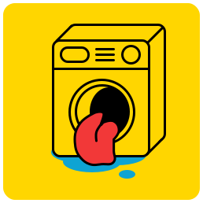

  

 <h1>Untitled Chore App</h1> 

Have you ever:

- ✅ Wondered why your house was such a mess?​
- ✅ Had to do all the chores in your house?​
- ✅ Ran out of toilet paper because no one bought any?​
- ✅ Had to dig out all your house-mates kitchen supplies from the sink?

It's a common problem at home for a lot of people; especially students. **Untitled Chore App* provides automated chore timetabling for each home you find yourself a part of that is refreshed weekly and allows you track which of your housemates aren't pulling their weight.

This project was part of the **Cloud Application Development** module at the **University of Southampton** and was a group project by:

- Myself 
- Tom Cutts [https://github.com/Spratt93](https://github.com/Spratt93)
- Dean Davey [https://github.com/Davey-Dean](https://github.com/Davey-Dean)
- Jaret Wrintmore [https://github.com/W8up](https://github.com/W8up)
